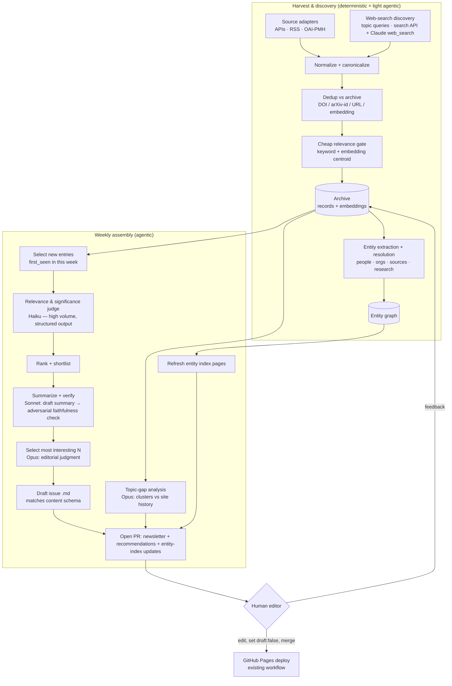

# Design: Automated Research-Radar & Newsletter Pipeline

**Status:** Draft for review · **Author:** Eigenius · **Last updated:** 2026-07-17

A pipeline that continuously scans the web for work relevant to the Eigenius
community's topics, maintains a durable archive of what it finds, and each week
(a) drafts a newsletter issue highlighting the most interesting *new* entries
with a short summary and a link to the primary source, (b) proposes topics
worth covering in a future article or blog post, and (c) maintains browsable
indexes of the people, organizations, sources, and research threads it tracks.

It uses agentic AI (Claude) for the judgment-heavy stages — relevance,
summarization, faithfulness checking, selection, and topic ideation — while
keeping the high-volume, deterministic stages (harvesting, dedup, indexing) as
plain code. A human editor approves every issue before it publishes.

---

## 1. Goals and non-goals

### Goals

1. **Discover** relevant material across scientific papers, preprints, company
   and industry news, and opinion leaders, on a recurring basis.
2. **Archive** everything relevant in a durable, deduplicated, queryable index —
   the archive is the source of truth for "what is new this week."
3. **Draft** a weekly newsletter issue that calls out the most interesting new
   entries, each with a faithful one-paragraph summary and a link to the
   original source.
4. **Recommend** new article/blog topics based on emerging themes and gaps
   relative to what the site has already covered.
5. **Index the field** — extract the people, organizations, sources, and
   research threads behind the archived items and give each a browsable,
   sourced page, turning the archive into a small knowledge base of the space.
6. **Slot into the existing site** — a draft issue (and refreshed entity index
   pages) land as content in the site repo matching its schema, via a pull
   request, ready for an editor to review and merge.

### Non-goals (initially)

- **No auto-publishing.** The pipeline drafts; a human merges. This is an
  editorial product and a reputational surface.
- **No email delivery.** The newsletter is archive + RSS today (see the site
  README); email is a separate, later concern. The pipeline produces the issue
  content regardless of delivery channel.
- **No full-text reproduction.** We store metadata, links, and short
  transformative summaries — never republish copyrighted article bodies.
- **No general-purpose crawler.** We prefer official APIs and RSS/Atom feeds
  over scraping; scraping is a last resort, gated on robots.txt and ToS.

### Guiding principle — the newsletter shows its work

Eigenius is about *warranted* claims: every assertion records how it was
justified. The pipeline should hold itself to the same standard. Concretely:

- Every newsletter item links to a **primary source**, and its summary is
  **verified against that source** by a separate checking pass before it can be
  included. A confident-sounding summary that the source doesn't support is a
  bug, not a stylistic quibble.
- Every selected item carries an **audit trail** in the archive — which sources
  surfaced it, what scores it got, which model wrote and checked the summary.
  An editor can always ask "why is this here?" and get an answer.

This is not decoration: hallucinated summaries of scientific papers are exactly
the failure mode a newsletter in this space must not have.

---

## 2. Scope of coverage (topic taxonomy)

The editorial focus, turned into a concrete taxonomy the ranking and selection
stages score against. Each item is tagged with one or more of these; the tags
also feed the newsletter's section structure and the site's content `tags`.

| Key | Topic | Example signals |
| --- | --- | --- |
| `neurosymbolic` | Neurosymbolic techniques | LLM + symbolic reasoning, program synthesis, neuro-symbolic architectures, knowledge-graph-grounded models |
| `ai-scientist` | AI Scientists & AI-supported research | autonomous research agents, hypothesis generation, lab automation, self-driving labs |
| `formal-verification` | Formal verification of / with AI | verifying model outputs, proof-carrying reasoning, LLM-assisted proving, spec compliance |
| `verified-science` | Verified science & reproducibility | machine-checkable claims, auditable pipelines, reproducibility infrastructure |
| `formal-methods` | Formal methods in science & engineering | theorem proving (Lean/Coq/Isabelle), model checking, type systems, SMT in scientific/eng workflows |
| `ai-life-sciences` | AI-science for Life Sciences & Medicine | protein/molecule models, drug discovery, clinical reasoning, comp-bio agents |

**Topic anchors.** Each key has a small set of hand-written "anchor"
descriptions and seed papers used to (a) compute an embedding centroid for cheap
first-pass relevance and (b) prime the LLM relevance rubric with what does and
does not belong. Anchors are versioned in the repo and tuned from editor
feedback — they are the single most important knob for precision.

---

## 3. Sources

Prefer, in order: **official API → RSS/Atom feed → sanctioned bulk export →
(last resort) polite scrape**. Each source is a small adapter emitting the
common record schema (§5).

### Scientific papers & preprints

- **arXiv** — API (Atom) and OAI-PMH for backfill. Categories: `cs.AI`, `cs.LG`,
  `cs.LO`, `cs.SC`, `cs.PL`, `cs.SE`, `cs.MS`, `math.LO`, `stat.ML`, `q-bio.*`.
  Respect the rate limits and the "no more than one request every few seconds"
  etiquette; use OAI-PMH for the one-time historical seed.
- **Semantic Scholar (S2)** — paper search + bulk API, citation counts and
  citation velocity (a strong "interestingness" signal). Free tier with a key.
- **OpenReview** — venue submissions/decisions (ICLR, NeurIPS, etc.).
- **bioRxiv / medRxiv** — APIs, for the life-sciences/medicine strand.
- **Crossref / DOI** — canonicalization and metadata enrichment.

### Venues (for cadence-aware harvesting)

- **AI/ML:** NeurIPS, ICML, ICLR, AAAI.
- **Formal methods / verification:** CAV, POPL, PLDI, LICS, ITP, CPP, TACAS, FM,
  AITP (AI + theorem proving).
- **Comp-bio / medicine:** ISMB, RECOMB, ML4H.

### Company & industry news

- **Org blogs / newsrooms** (RSS where available): DeepMind, Google Research,
  Anthropic, OpenAI, Meta FAIR, plus focused players in this space — e.g.
  FutureHouse, Isomorphic Labs, Recursion, EvolutionaryScale, the Lean FRO,
  Harmonic/Axiom-style formal-math startups. The exact list is a versioned,
  editor-owned config file.
- **Aggregators:** Hacker News (Algolia API, keyword-filtered), curated
  subreddits, Google/Bing News queries per topic.

### Opinion leaders

- **Curated feed list** of researcher blogs and Substacks (RSS/Atom), plus a
  small allowlist of high-signal social accounts. Social is the least
  API-friendly and highest-noise source; treat it as optional Phase 4 and lean
  on RSS-backed blogs first.

### Web-search discovery

The feed and API sources above only surface material from places we already
know to watch. **Topic-driven web search is how we discover the rest** — a new
lab blog, a company announcement, a news write-up, an opinion piece, or a paper
that none of our fixed sources carried. It is a first-class input to the
archive, not an afterthought.

Each topic (§2) has a set of **query templates** — an editor-owned config
(`queries.yaml`, sibling to `sources.yaml`) — run on a recurring cadence with a
recency filter (bias to the last 1–2 weeks). Results are URLs that flow into the
exact same pipeline as everything else: normalize → dedup (so a paper already
caught via arXiv just gains a "surfaced by search too" sighting) → cheap gate →
archive. Two complementary layers, detailed in §6.1:

- **Search-API sweep** (deterministic) — templated queries against a search API,
  cheap and controllable, run every harvest.
- **Agentic search** (Claude `web_search`) — an open-ended weekly "what's new
  and interesting in <topic> this week" pass that writes and refines its own
  queries and recognizes relevance on the fly, catching what rigid templates
  miss.

> Both the source registry and the query set are **data, not code** — versioned
> configs (`sources.yaml`, `queries.yaml`) the editor can edit without touching
> the pipeline. Adding a blog or a search query is a one-line PR.

---

## 4. Architecture

Two rhythms: a lightweight **daily harvest** that keeps the archive fresh and
spreads API load, and a **weekly assembly** that produces the issue and topic
recommendations from the week's new entries.



### Stages

1. **Harvest** (daily, deterministic). Each adapter pulls new candidates since
   its last watermark. No LLM. Cheap, parallel, resumable.

2. **Normalize & canonicalize.** Map every candidate to the common record
   schema. Derive a canonical identity: DOI › arXiv id › canonical URL. Extract
   title, authors, venue/source, publication date, abstract/description.

3. **Dedup.** The same work often appears on arXiv, a company blog, and Hacker
   News. Collapse to one archive record with multiple `sightings[]`. Dedup keys:
   exact canonical id, then near-duplicate title + author overlap, then
   embedding cosine similarity above a threshold. The number of independent
   sightings is itself a signal of significance.

4. **Cheap relevance gate.** Drop the obviously off-topic before spending any
   model tokens: keyword match against the taxonomy plus embedding similarity to
   the topic anchors (§2). Tunable recall-biased threshold — better to admit a
   marginal item and let the LLM judge drop it than to silently discard.

5. **Archive & enrich.** Everything that passes the gate is written to the
   archive with `first_seen = now`. "New this week" is simply `first_seen` within
   the window — this is what makes weekly novelty detection trivial and reliable
   rather than a diffing heuristic. At archive time each record is also
   **enriched with entities** — the people, organizations, sources, and research
   threads it involves — building the entity graph incrementally (§7).

6. **Relevance & significance judge** (weekly, agentic, high volume). For each
   new entry, a cheap model (**Haiku 4.5**) returns a structured verdict:
   relevance score per topic, an overall significance estimate, and a one-line
   rationale. Structured outputs make this a validated object, not free text.
   The shared taxonomy/rubric is prompt-cached across the batch.

7. **Rank & shortlist.** Combine signals into a score: LLM relevance ×
   significance, source authority, recency, citation velocity (from S2), and
   number of independent sightings. Shortlist the top items per topic.

8. **Summarize + verify** (agentic, the warrant step). A mid-tier model
   (**Sonnet 5**) fetches the primary source (via the `web_fetch` server tool),
   writes a tight one-paragraph summary, and then a **separate adversarial pass**
   checks the summary against the fetched source: are all claims supported? does
   the link resolve to what the summary describes? Fail → regenerate or drop.
   This is the mechanism behind "the newsletter shows its work."

9. **Select** (agentic, editorial judgment). A strong model (**Opus 4.8**)
   reviews the verified shortlist and picks the most interesting *N* for the
   issue, balancing across topics and against redundancy, and writes the issue's
   framing/intro. Output is structured (ordered selections + section
   assignments), not prose to be parsed.

10. **Draft the issue.** Render the selections into a Markdown file matching the
    existing newsletter schema (§5) — auto-assigned next `issue` number,
    `pubDate`, `description`, `tags`, `draft: true`, and a body organized by
    section (papers / industry / opinion) with summary + source link per item.

11. **Topic recommendations** (agentic). A separate Opus pass clusters recent
    new entries, compares them to what the site has already published
    (`src/content/{articles,blog,newsletter}`), and proposes article/blog topics
    with a rationale and 2–3 supporting sources each. Output as a recommendations
    file and/or GitHub issues.

12. **Human editorial gate.** The pipeline opens a **pull request** carrying the
    draft issue and the recommendations. The editor edits, flips `draft: false`,
    and merges — which triggers the site's existing GitHub Pages deploy. Nothing
    reaches readers without a human merge. Editor edits (what got cut, what got
    reworded) are the training signal for tuning anchors and rubric.

---

## 5. Data model

### Archive record

One record per canonical work; multiple sightings roll up into it.

```jsonc
{
  "id": "sha256:…",                     // content-addressed canonical id
  "canonical": { "type": "arxiv", "value": "2507.01234" },  // or doi | url
  "title": "…",
  "authors": ["…"],
  "source_kind": "paper|preprint|industry|opinion|news",
  "url": "https://…",                   // primary source
  "published_at": "2026-07-14",
  "first_seen": "2026-07-15T09:00:00Z", // drives "new this week"
  "abstract": "…",                      // as provided by the source
  "topics": ["neurosymbolic", "formal-methods"],
  "embedding_ref": "vec:…",
  "sightings": [                        // dedup rollup — also a signal
    { "source": "arxiv", "url": "…", "seen": "…" },
    { "source": "hn",    "url": "…", "seen": "…" }
  ],
  "signals": {                          // audit trail
    "relevance": { "neurosymbolic": 0.9 },
    "significance": 0.72,
    "citation_velocity": 3,
    "judge_model": "claude-haiku-4-5",
    "rationale": "…"
  },
  "editorial": {                        // filled during weekly assembly
    "summary": "…",
    "summary_verified": true,
    "summary_model": "claude-sonnet-5",
    "selected_issue": 7
  }
}
```

### Mapping to the newsletter content schema

The draft-issue stage must emit exactly what `src/content.config.ts` already
requires for the `newsletter` collection — no schema changes needed:

```yaml
---
title: "…"                 # generated issue title
subtitle: "…"              # optional deck line
description: "…"           # 1–2 sentence summary (indexes + RSS)
issue: 7                   # next unused integer; unique or the build fails
pubDate: 2026-07-24        # the assembly date
author: "Eigenius"
tags: ["neurosymbolic", "ai-life-sciences"]  # union of selected topics
draft: true                # ALWAYS true from the pipeline
---
```

Filename convention `NNN-slug.md` (e.g. `007-…md`), matching the existing
`001-welcome.md`. The body is rendered from the selected records: an intro, then
sections with `### Title`, a one-paragraph summary, and a source link per item.

### Entity records & edges

Entities extracted from records (§7) are stored beside them, with typed edges
linking the two:

```jsonc
{
  "id": "person:orcid:0000-0002-1825-0097", // or org:ror:… | source:example.com | work:arxiv:2507.01234 | topic:neurosymbolic
  "kind": "person|organization|source|research",
  "display_name": "…",
  "canonical": { "type": "orcid|ror|domain|doi|arxiv|topic", "value": "…" },
  "aliases": ["…"],                     // name variants seen in the wild
  "links": { "homepage": "…", "orcid": "…", "ror": "…" },
  "tracked": true,                      // gates whether a public page is built
  "salience": { "items_30d": 4, "trend": "rising" }
}
// Edges connect a record to an entity, typed:
// { "from": "sha256:… (record)", "rel": "authored_by|affiliated_with|published_on|about|mentions", "to": "person:…" }
```

---

## 6. Fetch, store, index & retrieve

This is the heart of the archive: how content is pulled from each source, turned
into a stored record with a text snapshot, indexed for both semantic and keyword
search, and retrieved during weekly assembly and dedup.

### 6.1 Fetch toolchain (harvest)

Each source is a thin adapter with one job: emit normalized records since its
last watermark. Prefer the most structured access each source offers.

| Source | Access | Recommended tool (Python) |
| --- | --- | --- |
| arXiv (incremental) | Atom API | `arxiv` client, or `httpx` + `feedparser` |
| arXiv (historical backfill) | OAI-PMH | `sickle` (OAI-PMH harvester) |
| Semantic Scholar | REST (paper search, citations) | `httpx` + typed models (or the `semanticscholar` client) |
| Crossref (DOI metadata) | REST | `habanero` |
| bioRxiv / medRxiv | REST details API | `httpx` |
| RSS / Atom (org blogs, researcher blogs) | Feeds | `feedparser` |
| Hacker News | Algolia search API | `httpx` |
| Web-search discovery (deterministic) | Search API with freshness filter | Google Programmable Search — Custom Search JSON API (see §6.1.1) |
| Generic web pages (last resort) | HTTP + extraction | `httpx` + `trafilatura` (main-content extraction) |
| Agentic discovery / reading | Claude server tools | `web_search_20260209`, `web_fetch_20260209` |

**Two fetch layers, deliberately separate:**

- **Deterministic harvest** (daily job) uses the plain HTTP/feed clients above.
  It's cheap, parallel, cacheable, and resumable — no model tokens spent to find
  out something is off-topic.
- **Agentic fetch** (weekly assembly) uses Claude's `web_fetch` server tool so
  the summarize/verify agent reads the *actual* primary source before writing
  about it. Keep per-source reads to the shortlist; they cost tokens.

#### 6.1.1 Web-search discovery — two layers

Web search runs at two levels of cost and openness; both feed the same
normalize → dedup → gate → archive path, so search-discovered items dedup
cleanly against the feed harvest.

- **Search-API sweep (deterministic, every harvest).** Issue the per-topic
  query templates (`queries.yaml`) against a search API with a recency filter,
  collect result URLs + snippets, and hand them to normalization. No model
  tokens; controllable and cheap. **Decided: Google Programmable Search** (the
  Custom Search JSON API), for GCP consistency — a Programmable Search Engine
  configured to search the whole web, queried with `key` + `cx` and a
  `dateRestrict` recency window; implemented in `sources/search/google.ts`.
  **Vertex AI Search** is the heavier alternative (a search app over data
  stores / grounded search) — more than a query→URLs sweep needs, so it's the
  upgrade path, not the default. The provider sits behind the `SearchProvider`
  interface, so swapping to Tavily/Brave/Bing later is one file.

  Controls: cap results per query, apply the freshness window, and dedup against
  the archive *before* the cheap gate so recurring hits cost nothing.

- **Agentic search (weekly, Claude `web_search_20260209`).** A per-topic
  open-ended pass — "surface the most notable new work in <topic> from the last
  week" — where the model writes and refines its own queries, follows leads, and
  returns candidate URLs with a one-line relevance note. This catches what fixed
  templates miss (new terminology, an unexpected venue, a cross-disciplinary
  result). It costs tokens, so it runs once per topic per week over a bounded
  budget, and its output is candidates for the archive — **not** a shortcut past
  the same dedup, gate, summarize, and faithfulness-verify steps every other
  item goes through.

Either layer only *discovers* URLs; the summary a reader sees is still written
from the stored snapshot and verified against the source (§4.8). Search decides
what to look at, not what to claim.

**Politeness & robustness (harvest layer):**

- One shared async `httpx` client with per-host concurrency caps and a token-bucket
  rate limiter; honor `Retry-After` and back off on 429/503.
- Check `robots.txt` (`urllib.robotparser`) before any non-API fetch; skip
  disallowed paths.
- Conditional requests (`ETag` / `If-Modified-Since`) and per-source watermarks
  (highest `published_at` or an API cursor) so each run pulls only what's new.
- Every adapter is idempotent — re-running a day is a no-op against the archive.

### 6.2 Storage layout

The archive separates a **durable source of truth** from a **derived,
disposable index**. That split is what lets it run on ephemeral CI runners
without a database server (see "Where it runs" below).

**Source of truth** (persisted; version-controlled, so the archive's own
provenance is auditable):

1. **Record log — append-only JSONL** (`archive/records/YYYY-MM.jsonl`). One
   line per canonical work (§5 schema), human-readable and diffable. Nothing is
   destructively edited; corrections are new versioned lines.
2. **Content snapshots — text, content-addressed**
   (`archive/snapshots/<sha256>.txt`). The extracted plain-text of each fetched
   source (abstract, or `trafilatura`-extracted body), keyed by a hash of the
   URL + fetch date. The summarize/verify agent reads the snapshot rather than
   re-fetching, so the *exact* text a summary was checked against is preserved.
   Extracted text only — never raw HTML or full PDFs (§11).
3. **Embedding vectors — append-only sidecar** (`archive/vectors/YYYY-MM.*`).
   Persisted next to the records so each is computed **once and never
   recomputed** — embeddings are a paid API call now (§6.5). New content only,
   so growth is bounded (a few KB per record).

**Derived** (disposable, rebuilt on demand — **not** committed):

4. **Index — SQLite** (`index.db`) with FTS5 + `sqlite-vec`, rebuilt from
   (1)–(3). Committing a binary DB to git would bloat history on every run;
   instead it's a build artifact regenerated by loading the committed rows and
   vectors into tables and indexes — no network, no model calls, so it's fast at
   this scale.

**Where it runs — local and CI, against the same archive.** The scheduled
daily/weekly jobs run in GitHub Actions (the recommended substrate, §9);
development and manual runs happen locally. Neither environment "owns" a
database. Each run checks out the archive from git, rebuilds `index.db` from the
committed JSONL/snapshots/vectors, does its work, and commits new
records/snapshots/vectors back. Because the DB is always regenerated from
committed data, **local and CI are byte-identical and there's no "which copy is
authoritative" problem** — the git archive is authoritative, the SQLite file is
throwaway. In CI, the rebuild can be skipped on the hot path by caching
`index.db` (keyed on the archive commit) with rebuild-on-miss. When the archive
outgrows git — large snapshot volume, or you'd rather one always-on store shared
by local and CI without checkout/commit — move the source of truth to object
storage or switch to Turso/libSQL (§6.6).

### 6.3 Indexing

A single SQLite file carries three coordinated indexes over the records:

- **Relational tables** — `records`, `sightings`, `signals`, `topics` for exact
  lookups and filtering (by topic, date window, source kind, `first_seen`,
  `selected_issue`). `first_seen` is indexed — "new this week" is one query.
- **Keyword index — FTS5** over title + abstract/snapshot, giving BM25 full-text
  search for exact-term and name matching (author names, "Lean", "SMT",
  gene/protein identifiers) that embeddings alone handle poorly.
- **Vector index — `sqlite-vec`** over the snapshot embedding (one vector per
  record), for semantic dedup and semantic relevance/retrieval.

Indexing is **incremental**: the harvest job upserts each new/changed record into
all three indexes in the same transaction, so the index never drifts from the
log. A full rebuild from JSONL + snapshots is always available as the recovery
path (and how you'd migrate embedding models — re-embed snapshots, rebuild the
vector table).

### 6.4 Retrieval (hybrid)

Three query shapes, all served from `index.db`:

1. **Dedup lookup** (harvest, per candidate): exact canonical id → title/author
   near-match (FTS5) → embedding cosine similarity (`sqlite-vec`) above a
   threshold. A hit rolls the candidate into an existing record as a new
   sighting rather than creating a duplicate.
2. **New-this-week selection** (weekly): relational filter on `first_seen` within
   the window, joined with `signals` for ranking. No search needed — just an
   indexed scan.
3. **Relevance / gap retrieval** (ranking and topic recommendations):
   **hybrid search** — run the topic-anchor query through both FTS5 (BM25) and
   the vector index, then fuse with **reciprocal-rank fusion**. Hybrid beats
   either alone here: embeddings catch paraphrase and cross-vocabulary matches;
   BM25 catches exact technical terms and identifiers. An optional cross-encoder
   **rerank** on the top ~50 sharpens the final order before the LLM judge sees
   it. The topic-gap analysis retrieves recent entries per cluster and contrasts
   them with embeddings of the site's already-published content.

### 6.5 Embeddings

The Claude API has no first-party embeddings endpoint. **Decided (updated
2026-07-17): Vertex AI text embeddings** (`text-embedding-005` by default),
since the project runs on GCP. This keeps embeddings under the same GCP
billing, IAM, and data-residency as the rest of the infrastructure, with no
separate vendor: the harvest job authenticates with Application Default
Credentials (Workload Identity on GCP, `gcloud auth application-default login`
locally) and calls the Vertex predict endpoint. The client lives behind the
`Embedder` interface (`src/embeddings/vertex.ts`), so the model or provider is a
one-file swap.

Alternatives considered: a hosted third-party API (Voyage AI — strong on
scientific text, but a separate vendor outside GCP), or a local
sentence-transformers model (zero per-call cost but wants Python's ML ecosystem
and a heavier runtime). Vertex wins by consolidating on GCP.

Embed the snapshot (title + abstract/body) **once**, persist the vector to the
append-only sidecar (§6.2), and load it into `sqlite-vec` on index rebuild — so
a rebuild never re-calls the paid embeddings API. Keep the model name +
dimension with each vector so a mixed-model index is detectable. The vector
interface is small — swapping providers is a config change plus a re-embed of
the affected records.

### 6.6 Scaling & hosted options

Scale is modest — hundreds to low-thousands of records/week — so the single-file
SQLite store holds up for years with no server to operate. If a hosted store
becomes preferable: **libSQL/Turso** (hosted SQLite, minimal code change) or
**Postgres + pgvector + built-in FTS** (one engine for relational, keyword, and
vector). The adapter boundary around the index keeps this swappable; start
local, move only if operational needs demand it.

---

## 7. Entity layer & site indexes

The archive is a stream of items. Readers also want to browse by *who*, *which
organization*, *which source*, and *which research thread* — so the pipeline
extracts those entities, links them to the items they appear in, and gives each
a browsable page. This turns the archive into a small typed knowledge base of
the field (the same shape Eigenius itself is built around), and the entity graph
feeds back into selection and topic recommendations.

### 7.1 Entity types

| Kind | Covers | Canonical id (preferred → fallback) |
| --- | --- | --- |
| **Person** | researchers, paper authors, opinion leaders | ORCID → normalized name + affiliation |
| **Organization** | labs, companies, institutions, funders | ROR → registrable domain / normalized name |
| **Source** | publications, blogs, venues, domains | registrable domain |
| **Research** | topic-area hubs (the §2 taxonomy) + notable works/threads | topic key (areas) · DOI/arXiv id (works) |

Research spans two things on purpose: the six taxonomy areas become standing
**hub pages**, and individually notable works or research lines get their own
entries that cross-link the people and orgs behind them.

### 7.2 Extraction & resolution

- **Extract** from authoritative metadata first — arXiv/Crossref authors and
  affiliations, the source domain, the DOI — then an LLM structured-output pass
  over the snapshot to pull entities that aren't in the structured metadata (a
  blog naming a lab, the research thread a post belongs to).
- **Resolve** (the hard part — entity resolution) by canonical id first
  (ORCID/ROR/domain/DOI), then name normalization plus affiliation/embedding
  similarity above a confidence threshold. Ambiguous merges are **queued for
  editor review, not auto-merged** — a wrong merge silently attributes one
  person's work to another. Track `aliases` so future name variants resolve.
- **Link** with typed edges: `authored_by`, `affiliated_with`, `published_on`,
  `about` (topic/work), `mentions`. The edges are the entity graph; they're
  derived from the archive and fully rebuildable.

### 7.3 Store

Entities and edges live in the same `index.db` (tables `entities`,
`entity_aliases`, `edges`) with a JSONL provenance log, exactly like the record
archive (§6.2). Every association on an entity page is an edge back to a sourced
record — so an entity page is itself "showing its work," never an unsourced
profile.

### 7.4 Site pages

New browsable sections, built like the blog (a `getStaticPaths` route over a
dataset), reusing the existing chrome (`BaseLayout`, `TopNav`, cards) and
`withBase()`:

- `/people/`, `/organizations/`, `/sources/`, `/research/` — an index page plus
  a detail page per tracked entity.
- **Detail page:** what/who it is, canonical outbound links (homepage,
  ORCID/ROR), and a sourced, reverse-chronological list of tracked items, with
  cross-links to related entities (a person's org, an org's people, a source's
  items). Research-area pages double as topic hubs the newsletter and
  recommendations link into.
- **How pages are produced:** the pipeline publishes a **reviewed data extract**
  (JSON, or per-entity Markdown) into the site repo through the same weekly PR;
  Astro renders the routes from it. No new publishing path — it rides the
  existing Pages deploy.

### 7.5 Feedback into the pipeline

Entity **salience** — a person, org, or source spiking in new items — is a
selection signal ("this lab shipped three things this month") and a seed for
topic recommendations. Per-entity pages also give the newsletter somewhere to
link ("more from <lab>"), and the graph lets the topic-gap analysis reason over
who and what the site is (and isn't) covering.

### 7.6 Curation, accuracy & privacy guardrails

Publishing pages *about people* is an editorial surface with real obligations —
not an auto-generated directory:

- **Tracked-only.** A page exists only for entities flagged `tracked` (promoted
  by salience + editor approval). Everything else stays in the archive without a
  public page — no indiscriminate dump of every name ever mentioned.
- **Everything sourced.** Each claim on a page is an edge to a primary source —
  no unsourced biography or inferred attributes.
- **Public professional work only.** Aggregate public output and link to each
  person's own canonical presence; no private or personal data, no scraping of
  anything non-public.
- **Human gate + opt-out.** A person page publishes only after editor review,
  and there is an easy delist/removal path the pipeline honors on the next run.

This mirrors the newsletter's discipline: show the work, and keep a human in the
loop before anything about a real person goes live.

---

## 8. Agentic AI design

All model calls go through the Anthropic SDK. Model tiering matches cost to the
job (prices per million tokens, from the current model catalog):

| Stage | Model | Why | Input/Output $ /MTok |
| --- | --- | --- | --- |
| Relevance & significance judge (high volume) | `claude-haiku-4-5` | Cheap, fast, structured verdicts over many items | $1 / $5 |
| Summarize + faithfulness check | `claude-sonnet-5` | Strong reading + writing at moderate cost; `web_fetch` to read sources | $3 / $15 (intro $2/$10 through 2026-08-31) |
| Final selection + issue framing + topic recs | `claude-opus-4-8` | Best editorial judgment and long-context synthesis | $5 / $25 |

Reserve `claude-fable-5` ($10/$50) for anything that proves genuinely
hard for Opus in evaluation; it is not the default.

**Techniques (all supported on the tiers above):**

- **Server-side web tools.** `web_search_20260209` for agentic discovery
  (§6.1.1), `web_fetch_20260209` so the summarize/verify agent reads the actual
  source before writing about it. Dynamic filtering is built in — don't also
  declare standalone code execution alongside them.
- **Structured outputs** (`output_config.format`) for every scoring/selection
  step, so results are validated objects the pipeline can act on, not prose to
  parse.
- **Prompt caching** for the large, stable prefix (topic taxonomy, rubric,
  few-shot examples) across a batch of items — this is where most of the token
  savings come from on the high-volume judge stage.
- **Adversarial verification.** The faithfulness check is a *separate* call
  prompted to find unsupported claims and default to "not supported" when
  uncertain — not the same call that wrote the summary. Independent perspective
  is the point.
- **Tool runner.** Use the SDK's tool runner (`client.beta.messages.tool_runner`)
  to drive the fetch → summarize → verify loop rather than hand-writing it.

**Rough cost envelope.** At ~a few hundred new items/week: Haiku triage over
all of them plus Sonnet summaries over the shortlist plus a handful of Opus
selection/recommendation calls lands in the low tens of dollars per issue,
dominated by the Sonnet source-reading. Prompt caching and a recall-biased cheap
gate (§4.4) keep it there. Firm numbers come after Phase 1 measures real volume.

---

## 9. Orchestration & scheduling

The deterministic harvest and the agentic assembly can run on the same substrate
or be split. Two viable designs:

### Option A (recommended): GitHub Actions cron + Claude API, opens a PR

- A daily scheduled workflow runs the harvest/normalize/dedup/gate job and
  commits archive updates.
- A weekly scheduled workflow runs the agentic assembly (Anthropic SDK, tool
  runner) and opens a PR against the site repo with the draft issue and
  recommendations.
- **Why:** tightest fit with the repo and the existing Pages deploy; the PR is
  the natural editorial gate; lowest lock-in; secrets (`ANTHROPIC_API_KEY`,
  source API keys) live in Actions secrets. The pipeline is ordinary code you
  fully control.

### Option B: Managed Agents scheduled deployment

- A Managed Agents **scheduled deployment** (cron) fires the weekly assembly;
  Anthropic hosts the agent loop and a per-session sandbox. The agent can even
  open the PR itself via the GitHub MCP server.
- **Why:** no infrastructure to run the agent loop, hosted sandbox for tool
  execution, built-in session tracing. **Trade-off:** more moving parts and more
  Anthropic-platform coupling than a plain scheduled script; the deterministic
  harvest still wants to live somewhere (it can remain a GitHub Actions job).

**Recommendation:** start with **Option A** — a scheduled script that opens a
PR is the simplest thing that delivers the editorial gate, and it keeps the
whole pipeline as code in one place. Revisit Option B if running the harvest
host or the agent loop becomes a burden.

### Language & runtime

The agentic stages are a wash — the Anthropic SDK is first-class in both Python
(`anthropic`) and TypeScript (`@anthropic-ai/sdk`), and the TS SDK runs on Node
or Deno. The decision hinges on the deterministic harvest/index core and on
consistency with the rest of the stack.

| | Python | Node + TypeScript | Deno + TypeScript |
| --- | --- | --- | --- |
| Scientific-source clients | Best (`arxiv`, `feedparser`, `habanero`, `sickle`, `trafilatura`) | Decent (`rss-parser`, Readability, `cheerio`; arXiv/Crossref via plain REST) | Same as Node (npm/JSR compat) |
| Local embeddings / ML | Best (sentence-transformers, torch) | Weaker (transformers.js / ONNX) | Weaker (transformers.js / ONNX) |
| Reuse site's Zod content schema | No — revalidate via `astro check` | **Yes** — import `content.config.ts` | **Yes** |
| Runtime & CI footprint | Heavier (venv + native ML deps) | Light | Lightest (single binary, built-in TS, permissioned) |
| Fit with existing stack | New language | Matches the Astro site | Matches the site **and** the main `eigenius` repo (which already ships a `deno.json`) |

**The deciding factor is embeddings.** With **local** embeddings, Python's ML
ecosystem is a real advantage and the safe pick. With a **hosted** embeddings
API (Vertex AI — see §6.5), Python's main edge disappears and a TypeScript
pipeline becomes attractive: one language across the site and the pipeline,
direct reuse of the content schema to validate generated issues *and* entity
pages, and a lighter CI.

**Decision (2026-07-17): Deno + TypeScript, paired with hosted embeddings
(Vertex AI, §6.5).** It keeps the whole property in one language, reuses the
site's schema, and matches tooling the org already runs. The remaining harvest
needs — feeds, HTTP, content extraction — are all well served in TS. (Python was
the
alternative, warranted only if local embeddings or the richest scientific-source
clients were required; the hosted-embeddings decision removes that pull.) The
draft/entity-page stages validate their output against `src/content.config.ts`
before opening the PR.

---

## 10. Module layout (Deno + TypeScript)

### Repos

Three repos, each with one job (resolves the layout half of §14.3):

- **`eigenius/radar`** — the pipeline code (this layout).
- **`eigenius/radar-archive`** — the git source-of-truth archive (records,
  snapshots, vectors). Separate so the archive's high-churn history doesn't bury
  the code history; the pipeline clones it at the start of each run (§6.2). (An
  orphan `archive` branch inside `radar` is a lighter alternative.)
- **`eigenius/online`** — the site; the pipeline opens PRs here with the draft
  issue and entity-page data.

### Tree

```
radar/
├─ deno.json                    # tasks, import map, lint/fmt
├─ deno.lock
├─ config/
│  ├─ topics.yaml               # taxonomy + anchors (§2)
│  ├─ sources.yaml              # source registry (§3)
│  └─ queries.yaml              # per-topic search templates (§6.1.1)
├─ src/
│  ├─ types.ts                  # Record, Sighting, Signals, Entity, Edge (§5)
│  ├─ config.ts                 # load + zod-validate the YAML configs
│  ├─ sources/                  # harvest adapters — deterministic, no Claude
│  │  ├─ adapter.ts             #   interface SourceAdapter { since(watermark) → Candidate[] }
│  │  ├─ arxiv.ts  semantic_scholar.ts  crossref.ts  biorxiv.ts
│  │  ├─ rss.ts    hacker_news.ts
│  │  ├─ search/                #   web-search discovery (§6.1.1)
│  │  │  ├─ provider.ts         #     interface SearchProvider { search(query, since) → Hit[] }
│  │  │  └─ google.ts           #     Google Programmable Search (§14.6)
│  │  └─ registry.ts            #   build adapters from sources.yaml
│  ├─ fetch/
│  │  ├─ http.ts                # shared client: rate-limit, retry, Retry-After, ETag
│  │  ├─ robots.ts              # robots.txt gate
│  │  └─ extract.ts             # main-content extraction (Readability + deno-dom)
│  ├─ pipeline/
│  │  ├─ normalize.ts           # canonical id + common record (§4, stage 2)
│  │  ├─ dedup.ts               # canonical / title / embedding dedup (stage 3)
│  │  ├─ gate.ts                # cheap relevance gate (stage 4)
│  │  └─ rank.ts                # signal fusion + shortlist (stage 7)
│  ├─ store/
│  │  ├─ records.ts             # JSONL append/read            (§6.2 tier 1)
│  │  ├─ snapshots.ts           # content-addressed text        (tier 2)
│  │  ├─ vectors.ts             # embedding sidecar             (tier 3)
│  │  ├─ index.ts               # libSQL: build/open, FTS5 + vectors (tier 4)
│  │  └─ retrieve.ts            # hybrid search + RRF (§6.4)
│  ├─ embeddings/
│  │  ├─ embedder.ts            # interface Embedder { embed(texts) → Vector[] }
│  │  └─ vertex.ts              # Vertex AI embeddings via REST (§6.5)
│  ├─ entities/
│  │  ├─ extract.ts             # metadata + LLM extraction (§7.2)
│  │  ├─ resolve.ts             # resolution + merge-review queue (§7.2)
│  │  └─ graph.ts               # edges + salience (§7.3, §7.5)
│  ├─ agents/                   # the only Claude-dependent code
│  │  ├─ client.ts              # SDK client, model tiers, prompt caching
│  │  ├─ schemas.ts             # zod schemas for structured outputs
│  │  ├─ judge.ts               # Haiku relevance/significance (§4, stage 6)
│  │  ├─ summarize.ts           # Sonnet summary + web_fetch (stage 8)
│  │  ├─ verify.ts              # Sonnet adversarial faithfulness (stage 8)
│  │  ├─ select.ts              # Opus selection + framing (stage 9)
│  │  └─ recommend.ts           # Opus topic-gap recs (stage 11)
│  ├─ render/
│  │  ├─ newsletter.ts          # → NNN-slug.md, validated vs content schema (§5)
│  │  ├─ entities.ts            # → entity data extract for the site (§7.4)
│  │  └─ schema.ts              # imports online's content.config.ts to validate
│  ├─ publish/
│  │  └─ github.ts              # branch + commit + open PR to eigenius/online
│  └─ jobs/
│     ├─ harvest.ts             # DAILY  (§4 daily rhythm)
│     └─ assemble.ts            # WEEKLY (§4 weekly rhythm)
├─ bin/radar.ts                 # CLI: harvest | assemble | backfill | rebuild-index | doctor
├─ tests/
└─ .github/workflows/
   ├─ harvest.yml               # cron: daily → commit to radar-archive
   └─ assemble.yml              # cron: weekly → open PR to eigenius/online
```

### The seams that map to the open decisions

Each provider choice is a single interface with swappable implementations, so
the still-open decisions stay cheap to change:

| Interface | File | Swap covers |
| --- | --- | --- |
| `SourceAdapter` | `sources/adapter.ts` | adding/removing any source |
| `SearchProvider` | `sources/search/provider.ts` | Google PSE → Tavily / Brave / Bing (§14.6) |
| `Embedder` | `embeddings/embedder.ts` | Vertex model → another provider or local |
| `Store` | `store/index.ts` | libSQL local file → Turso, no call-site change (§6.6) |

**libSQL note:** `@libsql/client` gives native vector search *and* FTS5 behind
one client — local-file mode now, hosted Turso later by changing only the
connection URL. That collapses the store seam and the §6.6 scaling path into one
line of config.

### Layering rule

`sources`, `fetch`, `pipeline`, `store`, `embeddings`, `entities` are
**deterministic and Claude-free** — pure, unit-testable, and where the daily
harvest lives. Only `agents/*` calls Claude, and only the weekly `assemble` job
uses it. `jobs/*` are thin orchestrators composing the modules; `bin/radar.ts`
is the CLI the workflows call. This mirrors the deterministic-vs-agentic split
the whole design rests on (§4).

### `deno.json` — tasks & runtime

```jsonc
{
  "tasks": {
    "harvest":       "deno run --allow-net --allow-read --allow-write --allow-env bin/radar.ts harvest",
    "assemble":      "deno run --allow-net --allow-read --allow-write --allow-env bin/radar.ts assemble",
    "backfill":      "deno run -A bin/radar.ts backfill",
    "rebuild-index": "deno run --allow-read --allow-write bin/radar.ts rebuild-index",
    "test":          "deno test --allow-read",
    "check":         "deno check bin/radar.ts && deno lint && deno fmt --check"
  },
  "imports": {
    "@anthropic/sdk": "npm:@anthropic-ai/sdk",          // agentic stages
    "@libsql/client": "npm:@libsql/client",             // store: vectors + FTS5
    "zod":            "npm:zod",                         // schemas / structured outputs
    "@std/yaml":      "jsr:@std/yaml",                   // config
    "readability":    "npm:@mozilla/readability",        // content extraction
    "deno-dom":       "jsr:@b-fuze/deno-dom"             // DOM for extraction
  }
}
```

Deno's permission flags double as a security boundary — the harvest needs
net/read/write/env and nothing needs `--allow-run`. Secrets (`ANTHROPIC_API_KEY`,
`VOYAGE_API_KEY`, source API keys, a GitHub token) come from the environment
(Actions secrets), read via `--allow-env`.

### Two entrypoints

- **`harvest`** (daily): clone `radar-archive` → run every `SourceAdapter` and
  the `SearchProvider` since their watermarks → normalize → dedup → gate → embed
  new items → append to records/snapshots/vectors → extract + resolve entities →
  commit back. No Claude (except the optional weekly agentic-search pass).
- **`assemble`** (weekly): rebuild the index → select new entries → `judge` →
  `rank` → `summarize` + `verify` → `select` → `render/newsletter` +
  `render/entities` → `recommend` → `publish/github` opens the PR to
  `eigenius/online`.

---

## 11. Legal, ethical & operational guardrails

- **Respect source terms.** Official APIs and RSS first; honor robots.txt and
  per-API rate limits; arXiv OAI-PMH etiquette for backfill. Scraping only where
  permitted, and never behind a paywall or login.
- **Copyright.** Store metadata, links, and short *transformative* summaries.
  Never reproduce article/paper bodies. For paywalled items, link only and
  summarize from the abstract/landing page.
- **Attribution.** Every item names its source and links to the primary source,
  not to an aggregator, wherever the canonical link is known.
- **No fabricated endorsements or quotes.** The faithfulness check exists partly
  to prevent the summary from putting words in an author's mouth.
- **Secrets.** API keys in Actions secrets / a secrets manager — never in the
  repo or in prompts (prompt/message history is persisted).
- **Failure modes surface, not hide.** If a source is down, an API rate-limits,
  or a summary fails verification, the run logs it and the PR notes what was
  skipped — a silent gap reads as "nothing happened this week," which is worse
  than a visible note.

---

## 12. Quality & evaluation

- **Editor keep-rate** — fraction of pipeline-selected items the editor keeps.
  The primary precision metric; drives anchor/rubric tuning.
- **Faithfulness pass-rate** — fraction of summaries that pass the adversarial
  check first try; a proxy for summary quality and model fit.
- **Dead-link rate** — every source link is resolved before the PR opens.
- **Coverage / recall spot-checks** — periodically, an editor lists notable work
  they expected and checks the archive caught it; misses point at a missing
  source or too-tight a gate.
- **Dedup accuracy** — sampled review of collapse decisions.

The editorial gate is also the feedback loop: cuts and rewrites are logged and
folded back into the anchors and the few-shot rubric.

---

## 13. Phased rollout

- **Phase 0 — Archive.** Source registry + harvest + normalize + dedup + cheap
  gate + storage. No LLM. Backfill a few months so the archive isn't empty.
  *Exit:* a queryable, deduplicated archive that grows daily.
- **Phase 1 — Weekly digest.** Add the Haiku relevance/significance judge and
  ranking; emit a raw ranked list of the week's new entries (no prose). Measures
  real volume and cost. *Exit:* a trustworthy "what's new and relevant" list.
- **Phase 2 — Drafted newsletter.** Add Sonnet summarize + Opus select + issue
  rendering + the PR flow. *Exit:* a mergeable draft issue every week.
- **Phase 3 — Warrant + recommendations.** Add the adversarial faithfulness
  check and the topic-gap recommendations. *Exit:* verified summaries and a
  standing topic backlog.
- **Phase 4 — Tuning & breadth.** Refine dedup, expand sources (opinion/social),
  tune anchors from editor feedback, revisit model tiers and cost.
- **Phase 5 — Entity indexes.** Entity extraction rides the harvest cheaply from
  Phase 0; this phase adds resolution, the `tracked` curation gate, and the
  generated `/people`, `/organizations`, `/sources`, `/research` pages.
  *Exit:* a browsable, sourced knowledge base that grows with the archive.

Each phase is independently useful; the archive (Phase 0) has value even if the
newsletter drafting is never turned on.

---

## 14. Open questions (decisions for you)

**Decided (2026-07-17):** **Deno + TypeScript** (§9); **Vertex AI embeddings**
(§6.5), as the project runs on GCP; **running locally to start** — the hosted
compute substrate is deferred (see item 1). Claude access stays on the
first-party Anthropic API for now.

Still open:

1. **Where does it run (hosted)?** Running locally to start. When hosted, the
   GCP-native path is **Cloud Run Jobs + Cloud Scheduler** (with the archive in a
   GCS bucket); GitHub Actions cron is the alternative. Separately, whether to
   move **Claude** onto Vertex AI (GCP-native IAM/billing, but no `web_fetch` and
   only basic `web_search` server tools) or keep the first-party Anthropic API.
2. **Archive storage?** Git-tracked JSONL + SQLite (recommended) vs a hosted DB
   from the start.
3. **Repo layout?** Pipeline as a directory in this repo, a sibling repo, or
   part of `eigenius/eigenius`. (This design doc lives in the site repo because
   it produces the site's content; the pipeline code likely wants its own home.)
4. **Budget ceiling** for LLM spend per issue, to fix the model tiers and the
   shortlist size.
5. **Source & query sign-off** — the initial `sources.yaml` (company blogs,
   opinion leaders) and `queries.yaml` (per-topic search templates) are
   editorial choices worth doing by hand.
6. **Discovery search API** — decided: **Google Programmable Search** (Custom
   Search JSON API), for GCP consistency; Vertex AI Search is the upgrade path
   (§6.1.1). Still needs a Programmable Search Engine (`cx`) + Custom Search API
   key, and wiring the query sweep into the harvest.
7. **Automation level** — confirm the human-merge gate (recommended) vs any
   appetite for auto-publishing routine issues later.
8. **Entity pages** — which entity types to launch first (people /
   organizations / sources / research), the `tracked`/notability threshold for
   generating a page, and the people-page privacy & opt-out policy (§7.6).

---

## Appendix: how this reuses what already exists

- **Output format** is the existing `newsletter` content collection — no schema
  change; the drafting stage targets `src/content.config.ts` as-is.
- **Publishing** is the existing GitHub Pages workflow (`deploy.yml`) — merging
  the PR is the only trigger needed.
- **RSS** — issues automatically enter the existing `/rss.xml` and
  `/newsletter/rss.xml` feeds once merged, which is also the seam where email
  delivery later attaches.
- **Entity pages** are new `getStaticPaths` routes (`/people/`,
  `/organizations/`, `/sources/`, `/research/`) that reuse the existing
  `BaseLayout`, `TopNav`, card components, and `withBase()` — the same rendering
  pattern as `blog/[...slug].astro`, with nav entries added to `TopNav` and
  `SiteFooter`. No new publishing path.
